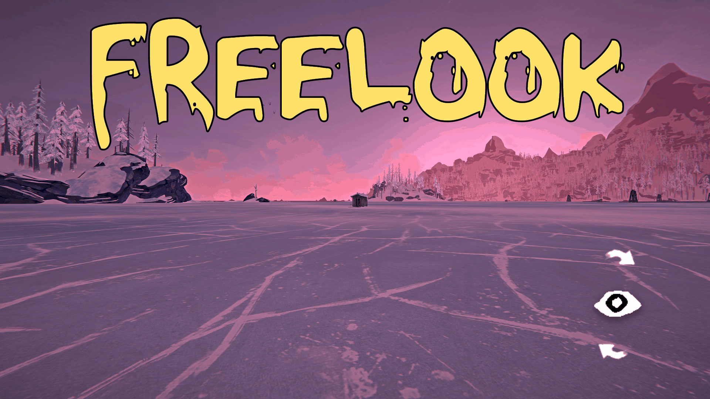
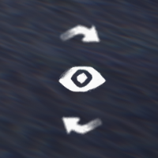

#### Finally look around freely while walking! Keep an eye on predators or just take in the beautiful scenery.

#### <u>Instructions</u>

- Hold/toggle the assigned key *(Default:LeftAlt)* and you can look away from the direction you are traveling without turning your character. Release and the view returns back to where you are heading. Also works to reach some normally out of reach compartments in vehicles! When FreeLook is locked by enabling toggle or double-tap mode, a small indicator icon appears.  Its position and size are adjustable, so it can be moved out of the way of other HUD mods, default is bottom right.
  
  

- **Focus View** -  While you are looking around, you can focus on things by holding or toggling the **Focus Key**, *default: MiddleMouse*. This only works while FreeLook is engaged.

#### <u>Notes</u>

- The first-person arms, clothing, and held item were only ever built to be seen from straight ahead. If you chose to show them by turning on **Show held item while looking**, be aware they will appear incomplete resulting in cut-off and/or clipping. You can also selectively hide them by changing **Hide beyond** to set how far you may look before they are hidden. Set it to 180 and they are always shown, glitches and all.
- You can still interact with whatever you are looking at, so a locker or a bed off to one side can be used without canceling free look first.
- A toggled free look is released whenever the game takes control: opening your inventory, the map or the pause menu, sleeping, or any scripted sequence.

#### <u>Using a controller</u>

- Turn on **Double tap to latch**, then use the game's own auto-walk control double-tapped to trigger free look.  

- Not sure how to handle **Focus View** on a controller yet. More to come.

#### <u>Settings</u>

Everything is configurable in-game under **Mod Settings → Free Look** - the key, hold versus toggle, how far the view may swing, how fast it returns, the zoom, and which focus effects are on. The defaults are the intended experience and nothing needs changing to use the mod.

**[Full settings reference, with screenshots →](SETTINGS.md)**

#### <u>Requirements</u>

- The Long Dark (built against 2.55)
- [MelonLoader](https://melonwiki.xyz/)
- [ModSettings](https://github.com/DigitalzombieTLD/ModSettings) - for the in-game settings page.

#### <u>Installation</u>

Drop `FreeLook.dll` into the game's `Mods` folder.

#### <u>Credits</u>

Idea: **Zaknafein** - [Road to 500 Days - Part 100](https://youtu.be/KTwYDL6Oq-s?t=2702)
