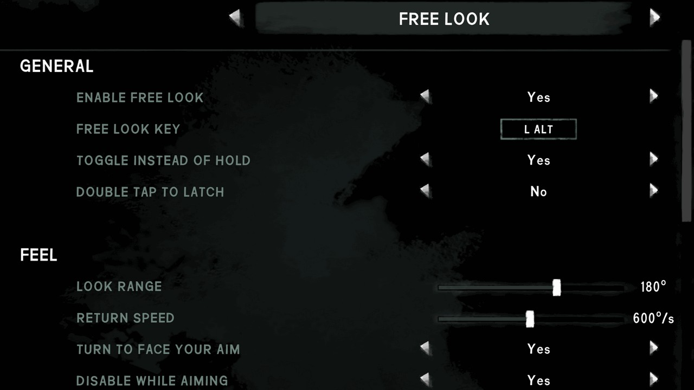
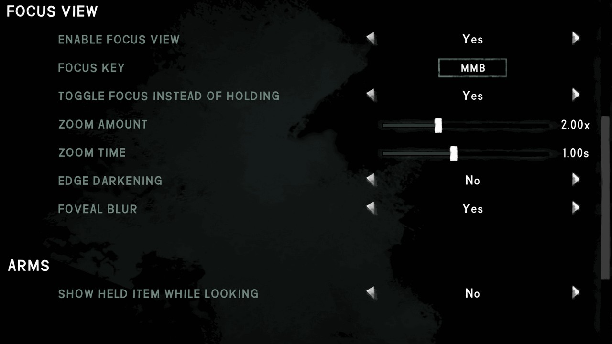
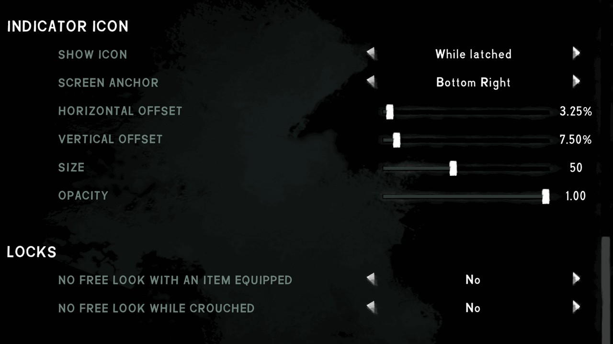

# Free Look settings

All of these are in-game under **Mod Settings → Free Look**. Nothing here needs touching to use the mod; the defaults are the intended experience.

| Setting                            | Default  | What it does                                                                                                          |
| ---------------------------------- | -------- | --------------------------------------------------------------------------------------------------------------------- |
| Enable free look                   | On       | Turn the whole feature off and restore stock camera behavior.                                                        |
| Free look key                      | Left Alt | The key held to look around. A mouse button works too.                                                                |
| Toggle instead of hold             | Off      | Tap to enter free look and tap again to leave, rather than holding.                                                   |
| Double tap to latch                | Off      | Holding still works, but a quick double tap latches free look on, and another releases it.                            |
| Look range                         | 180°     | How far the view may swing from your direction of travel, to each side. 180 is straight behind you; the slider reaches 270. |
| Return speed                       | 600°/s | How fast the view swings back once released. A quick glance returns promptly, a full swing takes proportionally longer. For scale, a relaxed look around is around 150°/s and the human limit is roughly 800°/s. Zero snaps instantly. |
| Turn to face your aim              | On       | Raising a weapon while looking around turns you to face where you were looking, rather than swinging your view back.  |
| Disable while aiming               | On       | Suppress free look while a weapon is raised, so your aim is never pointed somewhere you are not looking.              |
| Enable focus view                  | On       | Hold a second key, while already looking around, to zoom in on what you turned to see.                                |
| Focus key                          | Middle mouse | The key held to zoom. Vanilla leaves the middle mouse button unbound, so nothing else wants it.                    |
| Toggle focus instead of holding    | Off      | Tap to zoom in and tap again to come out, rather than holding. It still ends when free look does.                     |
| Zoom Amount                        | 2.00x    | How far focus view zooms in. The game's own zoom when aiming is about 1.43x. Look sensitivity drops by the same factor. |
| Zoom Time                          | 1.00s    | How long the zoom takes to arrive and to leave. Ignored when free look ends mid-zoom: the zoom then follows the view home so the two arrive together. |
| Edge darkening                     | On       | Darkens the screen edges while focused, as a smooth gradient that adds to the darkening the game already does. No amount to set. |
| Foveal blur                        | On       | Sharp in the middle, blurring toward the edges, the way your own vision works. How much is blurred is fixed.           |
| Show held item while looking       | Off      | Keep whatever is in your hands on screen while looking around. Expect visible cut-off edges; see [Notes](README.md#notes). |
| Hide beyond                        | 180°     | Used only when the held item is shown: how far you may look before it is hidden after all. At 180 it is never hidden. |
| Show icon                          | While latched | When the icon appears: whenever looking, only while latched on, or never.                                             |
| Screen anchor                      | Bottom right | Which corner the two offsets are measured from. The icon holds that place on any monitor or aspect ratio.              |
| Horizontal offset                  | 3.25%    | Distance from that corner as a percentage of screen width. 0 is in the corner, 100 the opposite side.                 |
| Vertical offset                    | 7.50%    | Distance from that corner as a percentage of screen height.                                                          |
| Size                               | 50       | Height of the icon on the interface, so it scales with the interface rather than with your resolution.                |
| Opacity                            | 1.00     | How strongly the icon is drawn. The game mutes its own icons slightly, so full strength stands out a little.          |
| No free look with an item equipped | Off      | Stand down entirely whenever something is in your hands.                                                              |
| No free look while crouched        | Off      | Stand down while crouched.                                                                                            |

<table>
  <tr>
    <td></td>
    <td></td>
  </tr>
  <tr>
    <td></td>
    <td></td>
  </tr>
</table>

[Back to the README](README.md)
